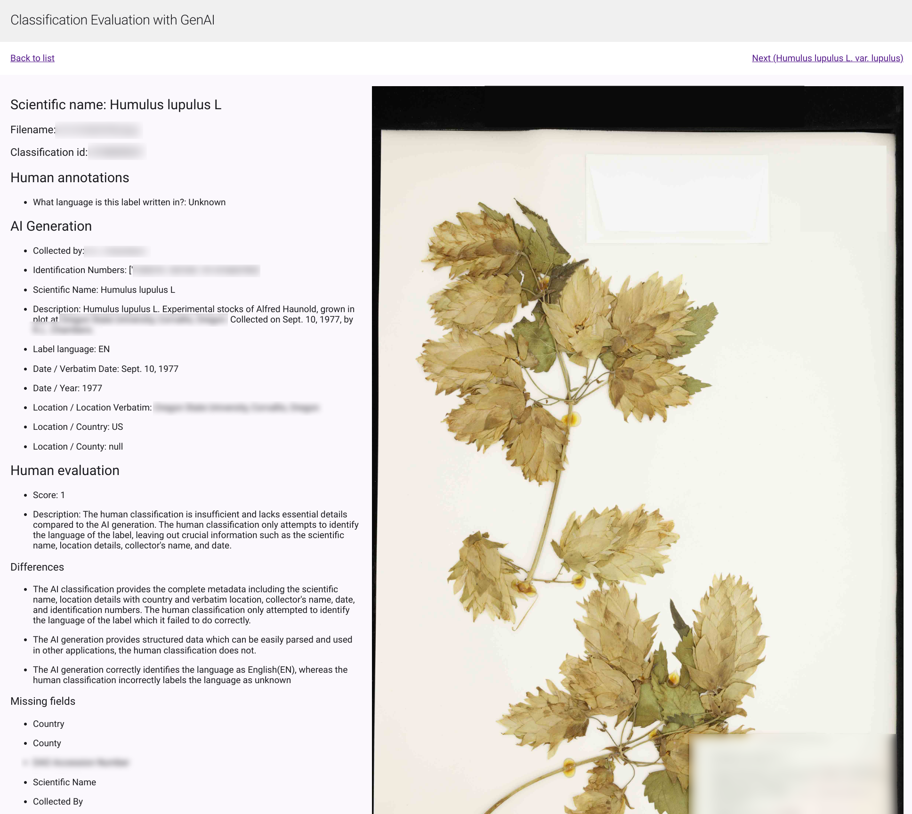

# human-classification-evaluation-with-genai

This use GenAI to evaluate the accuracy of human classification of plant samples.



### Vertex AI

The [`test-and-import.ipynb`](./test-and-import.ipynb) collab notebook reads data from a csv and uses images - both from a google drive share - to create context for a prompt that analyzes this data. The images are copied to a bucket. The prompt is sent to Vertex AI and the responses stored in BigQuery. 

### Cloud infrastructure needed

1. Create a bucket for images
2. Create a dataset in BigQuery with schema specified in [`bigquery-table-schema.json`](./bigquery-table-schema.yaml)
3. The `deploy.sh` script will create the cloud run service. 

### Local Environment Setup

Dependiencies
```bash
sudo apt-get install python3-virtualenv
virtualenv env
```

Install requirements
```bash
source env/bin/activate
pip install -r requirements.txt
cp .env.example .env 
```

Change Environment variables in .env
```bash
SERVICE_NAME="human-classification-evaluation-with-genai"
REGION="northamerica-northeast1"
PROJECT_ID="project-id"
BIGQUERY_TABLE="dataset.table"
IMAGE_BASE_URL="https://storage.googleapis.com/bucket-name/images/"
```

Start app
```bash
mesop main.py
```

### Deploy to Cloud Run

```bash
chmod 755 deploy.sh
./deploy.sh
```
